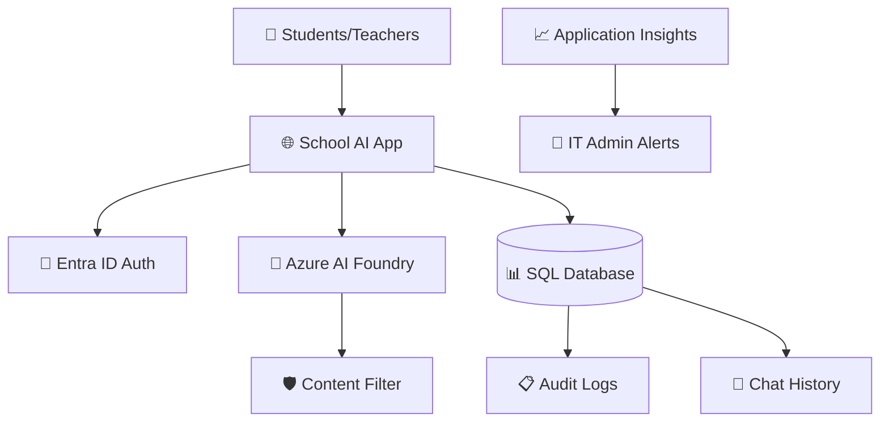

# 🏫 SchoolGPT - AI Assistant Template for Educational Institutions

**Deploy a secure, school-safe AI assistant in minutes using Azure AI Foundry**

[](https://portal.azure.com)
[](https://www.terraform.io/)
[](https://github.com/features/actions)

## 🎯 What This Template Provides

- 🧠 **Azure AI Foundry** - Latest GPT models with educational focus
- 🔒 **High Content Filtering** - Blocks inappropriate content automatically  
- 📚 **School-Safe Prompts** - Optimized responses for students under 16
- 🏫 **Multi-School Ready** - Each school gets their own complete deployment
- 📊 **Chat History & Auditing** - Full compliance and monitoring
- 🚨 **Real-time Alerts** - Instant notifications for policy violations
- 🔐 **Entra ID Authentication** - Secure school-only access

---

## 🚀 Quick Start for Schools

### Prerequisites
- Azure subscription with admin access
- GitHub account
- 15 minutes for setup

### Step 1: Get Your Azure Information

1. **Azure Subscription ID**: 
   - Go to [Azure Portal](https://portal.azure.com) → Subscriptions
   - Copy your Subscription ID

2. **Azure Tenant ID**:
   - Azure Portal → Azure Active Directory → Properties
   - Copy your Tenant ID

3. **Your Object ID** (for admin access):
   - Azure Portal → Azure Active Directory → Users → [Your Account]
   - Copy your Object ID

### Step 2: Fork This Repository

```bash
# 1. Click "Fork" on this GitHub repository
# 2. Clone your fork locally
git clone https://github.com/YOUR-USERNAME/schoolgpt.git
cd schoolgpt
```

### Step 3: Configure Your School

```bash
# Copy the template and customize it
cp infra/terraform.tfvars.template infra/terraform.tfvars
```

**Edit `infra/terraform.tfvars`** with your school's information:

```hcl
# Replace these with YOUR school's values
azure_subscription_id = "12345678-1234-1234-1234-123456789012"
azure_tenant_id       = "87654321-4321-4321-4321-210987654321"
school_name           = "Lincoln Elementary AI Assistant"
alert_email           = "it@lincoln.edu"
ai_foundry_name      = "lincoln-ai-foundry"      # Must be globally unique
web_app_name         = "lincoln-ai-app"          # Must be globally unique
sql_server_name      = "lincoln-ai-sql"          # Must be globally unique
# ... (see template for all options)
```

### Step 4: Deploy Infrastructure

```bash
cd infra

# Login to Azure
az login

# Initialize Terraform
terraform init

# Preview changes
terraform plan

# Deploy (takes ~10-15 minutes)
terraform apply
```

### Step 5: Configure GitHub Actions

Add these secrets to your GitHub repository (Settings → Secrets and variables → Actions):

```bash
# Get these values from terraform output
terraform output container_registry_credentials

# Add to GitHub Secrets:
AZURE_CREDENTIALS=<service-principal-json>
ACR_LOGIN_SERVER=<your-acr-name>.azurecr.io
ACR_USERNAME=<acr-username>
ACR_PASSWORD=<acr-password>
WEB_APP_NAME=<your-web-app-name>
RESOURCE_GROUP=<your-resource-group>
```

### Step 6: Deploy Application

```bash
# Push to trigger GitHub Actions deployment
git add .
git commit -m "Deploy SchoolGPT for [Your School Name]"
git push origin main
```

### Step 7: Configure Authentication

1. Wait 5-10 minutes for deployment to complete
2. Visit your app URL (from terraform output)
3. Click "Azure Portal" link on the authentication page
4. Add Microsoft as identity provider
5. ✅ **Your SchoolGPT is ready!**

---

## 🎓 School Customization Options

### Basic Configuration
```hcl
# School branding
school_name = "Washington High School AI Assistant"
alert_email = "technology@washington.edu"

# Performance tiers based on school size
app_service_sku = "B1"  # Small school (< 500 students)
app_service_sku = "B2"  # Medium school (500-1500 students)  
app_service_sku = "S1"  # Large school (1500+ students)

# AI model selection
azure_openai_model = "gpt-35-turbo"  # Cost-effective, fast
azure_openai_model = "gpt-4"         # Advanced reasoning, higher cost
```

### Advanced Customization

Future releases will include:
- Custom school logos and colors
- Personalized welcome messages  
- Subject-specific AI assistants
- Grade-level content filtering
- Integration with school systems

---

## 🔧 Architecture Overview



### Key Components

| Component | Purpose | School Benefit |
|-----------|---------|----------------|
| **Azure AI Foundry** | Latest GPT models with educational prompts | Safe, educational AI responses |
| **Content Filtering** | Blocks inappropriate content automatically | Protects students from harmful content |
| **SQL Database** | Stores chat history and audit logs | Compliance and monitoring |
| **Entra ID Auth** | School-only access control | Only authorized users can access |
| **Application Insights** | Real-time monitoring and alerts | Immediate notification of issues |
| **GitHub Actions** | Automated deployments | Easy updates and maintenance |

---

## 📋 Cost Estimation

### Small School (< 500 students)
- **Monthly Cost**: ~$150-200 USD
- **Configuration**: B1 App Service, S0 SQL, Basic monitoring

### Medium School (500-1500 students)  
- **Monthly Cost**: ~$250-350 USD
- **Configuration**: B2 App Service, S1 SQL, Standard monitoring

### Large School (1500+ students)
- **Monthly Cost**: ~$400-600 USD  
- **Configuration**: S1 App Service, S2 SQL, Premium monitoring

*Costs include: App Service, SQL Database, AI Foundry usage, Storage, Monitoring*

---

## 🛡️ Security & Compliance Features

### Built-in Safety
- ✅ **High content filtering** for all inappropriate content categories
- ✅ **Educational prompts** specifically designed for students under 16
- ✅ **Real-time monitoring** of all AI interactions
- ✅ **Automatic alerts** for policy violations
- ✅ **Complete audit trails** for compliance

### Data Privacy
- ✅ **School-only access** via Entra ID authentication  
- ✅ **Data residency** in your chosen Azure region
- ✅ **Encrypted storage** for all chat data
- ✅ **No data sharing** with external services
- ✅ **GDPR/COPPA compliant** architecture

### Administrative Controls
- ✅ **IT admin alerts** for unusual activity
- ✅ **Usage analytics** and reporting
- ✅ **Content filter logs** for review
- ✅ **User access management** via Azure AD
- ✅ **Emergency disable** capabilities

---

## 📚 Documentation

- **[Deployment Guide](DEPLOYMENT_GUIDE.md)** - Detailed step-by-step instructions
- **[Infrastructure README](infra/README.md)** - Technical infrastructure details
- **[Setup Script](setup.sh)** - Automated configuration helper

---

## 🤝 Support & Community

### Getting Help
- 📖 **Documentation**: See files above for detailed guides
- 🐛 **Issues**: Report bugs via GitHub Issues
- 💬 **Discussions**: Join our community discussions
- 📧 **Enterprise Support**: Contact for enterprise deployments

### Contributing
We welcome contributions from educators and developers:
- 🍴 Fork the repository
- 🌟 Star if you find it useful
- 🐛 Report issues and suggest improvements
- 💡 Share your school's customizations

### Roadmap
- [ ] Custom school branding system
- [ ] Subject-specific AI assistants  
- [ ] Integration with popular LMS platforms
- [ ] Mobile app companion
- [ ] Advanced analytics dashboard
- [ ] Multi-language support

---

## 📜 License

This project is licensed under the MIT License - see the [LICENSE](LICENSE) file for details.

---

## 🎉 Success Stories

> *"SchoolGPT has transformed how our students access educational support. The safety features give us confidence, and students love the instant help with their studies."*  
> **- Sarah Johnson, IT Director, Lincoln Elementary**

> *"Deployment took just 20 minutes. Our teachers are amazed by the educational quality of responses."*  
> **- Michael Chen, Technology Coordinator, Roosevelt High**

---

**Ready to give your school AI superpowers? Let's get started!** 🚀

[Deploy Now](https://portal.azure.com) | [View Demo](https://schoolgpt-webapp123.azurewebsites.net) | [Join Community](https://github.com/discussions) 