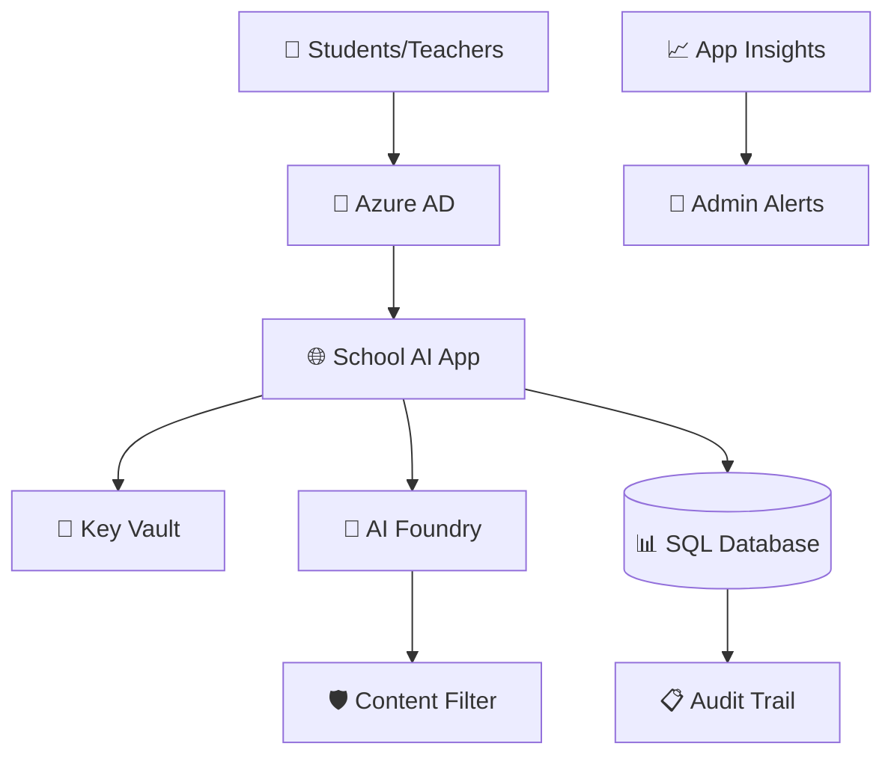

# 🏗️ SchoolGPT Infrastructure

**Enterprise-grade Terraform infrastructure for educational AI deployment**

---

## 📋 Overview

This directory contains the complete Terraform infrastructure code for deploying SchoolGPT, a production-ready AI assistant specifically designed for educational institutions. The infrastructure is fully automated and managed through GitHub Actions workflows.

### 🏆 Infrastructure Features

- 🧠 **Azure AI Foundry** - Latest GPT models with educational optimization
- 🔒 **Enterprise Security** - Key Vault, encryption, and access controls  
- 📊 **Compliance Monitoring** - SQL Database with audit logging
- 🚨 **Real-time Alerts** - Application Insights with custom monitoring
- 🐳 **Container Platform** - Azure Container Registry and App Service
- 🔄 **Automated State Management** - Remote Terraform state in Azure Storage
- 🏫 **Multi-school Ready** - Isolated deployments per institution

---

## 📁 File Structure

```
infra/
├── main.tf                          # Core infrastructure resources
├── variables.tf                     # Input variable definitions
├── terraform.tfvars                 # Environment-specific values
├── terraform.tfvars.school-template # Template for new schools
├── backend.tf                       # Remote state configuration (auto-generated)
├── .terraform.lock.hcl             # Provider version lock file
├── school_safe_database_schema.sql  # Database initialization script
└── README.md                       # This file
```

---

## 🚀 Deployment Methods

### Automated Deployment (Recommended)

**For Schools - Zero Technical Knowledge Required:**

1. **Fork Repository** → Get your own copy
2. **Add GitHub Secret** → Azure credentials only
3. **Run Setup Workflow** → Provide school name
4. **Deploy Infrastructure** → Fully automated
5. **Deploy Application** → Ready to use

All infrastructure is created, configured, and managed automatically.

### Manual Deployment (Advanced Users)

**For Developers and Technical Teams:**

```bash
# Prerequisites
az login
terraform --version  # Requires Terraform >= 1.0

# Setup
git clone <repository>
cd schoolgpt/infra

# Configure
cp terraform.tfvars.template terraform.tfvars
# Edit terraform.tfvars with your values

# Deploy
terraform init
terraform plan
terraform apply

# Application deployment requires additional steps
```

---

## 🏗️ Architecture Components

### Core Infrastructure

| Component | Purpose | Configuration |
|-----------|---------|---------------|
| **Resource Group** | Logical container for all resources | Auto-named per school |
| **Azure AI Foundry** | GPT model hosting with content filtering | School-safe prompts |
| **App Service** | Web application hosting | Auto-scaling enabled |
| **Container Registry** | Docker image storage | Private repository |
| **SQL Database** | Chat history and audit logging | Encrypted at rest |
| **Key Vault** | Secure secrets management | Access policies configured |
| **Application Insights** | Monitoring and analytics | Custom dashboards |
| **Storage Account** | Terraform state management | Geo-redundant |

### Security Architecture



---

## ⚙️ Configuration

### School-Specific Variables

**Automatically Generated (via workflows):**
```hcl
# Infrastructure naming (auto-generated)
resource_group_name   = "lincolnelementary-production-rg"
ai_foundry_name      = "lincolnelementaryaifoundryabc123"
web_app_name         = "lincolnelementarywebappabc123"
sql_server_name      = "lincolnelementarysqlsrvabc123"
key_vault_name       = "lincolnelementarykvaabc123"
```

**School-Provided Values:**
```hcl
# Azure account information
azure_subscription_id = "your-subscription-id"
azure_tenant_id       = "your-tenant-id"

# School information
school_name = "Lincoln Elementary School"
alert_email = "it@lincoln.edu"

# Administrative access
sql_azuread_admin_login = "admin@lincoln.edu"
sql_azuread_admin_object_id = "user-object-id"
key_vault_admin_object_id = "user-object-id"
```

### Performance Tiers

**Small School (100-500 students):**
```hcl
app_service_sku = "B2"
sql_sku_name    = "S1"
model_capacity  = 120  # Tokens per minute
```

**Medium School (500-2000 students):**
```hcl
app_service_sku = "S2"
sql_sku_name    = "S2"
model_capacity  = 240
```

**Large School (2000+ students):**
```hcl
app_service_sku = "P1v2"
sql_sku_name    = "S3"
model_capacity  = 480
```

---

## 🔒 Security Configuration

### Content Filtering (High Level)
```hcl
# Automatically configured for educational safety
AZURE_OPENAI_CONTENT_FILTER_HATE     = "2"  # High filtering
AZURE_OPENAI_CONTENT_FILTER_SEXUAL   = "2"  # High filtering  
AZURE_OPENAI_CONTENT_FILTER_VIOLENCE = "2"  # High filtering
AZURE_OPENAI_CONTENT_FILTER_SELF_HARM = "2" # High filtering
```

### Access Controls
- **Azure AD Integration** - School domain authentication only
- **Role-Based Access** - Students, teachers, and admins
- **Network Security** - HTTPS enforcement, secure headers
- **Data Encryption** - At rest and in transit

### Audit & Compliance
- **Complete Conversation Logging** - All AI interactions recorded
- **Retention Policies** - Configurable data retention (default: 90 days)
- **Export Capabilities** - Compliance reporting and data export
- **Monitoring Alerts** - Real-time policy violation detection

---

## 📊 Monitoring & Alerts

### Application Insights Dashboards

**Usage Analytics:**
- Student interaction patterns
- Popular question categories
- Response quality metrics
- Peak usage times

**Security Monitoring:**
- Content filter activations
- Authentication failures
- Unusual access patterns
- Policy violations

**Performance Metrics:**
- Response times
- System availability
- Resource utilization
- Error rates

### Automated Alerts

```hcl
# Content filter violations → Email to IT admin
# High usage periods → Cost optimization alerts
# System errors → Incident creation
# Security events → Immediate notification
```

---

## 💰 Cost Management

### Resource Optimization

**Automatic Scaling:**
- App Service scales with demand
- Database resources adjust to usage
- AI Foundry costs based on actual tokens

**Cost Monitoring:**
- Daily cost alerts for budget overruns
- Usage analytics for optimization
- Monthly cost reports per school

### Estimated Monthly Costs

| School Size | App Service | AI Foundry | SQL Database | Storage/Monitoring | **Total** |
|-------------|-------------|------------|--------------|-------------------|-----------|
| Small (100-500) | $55 | $50-100 | $20 | $10 | **$135-185** |
| Medium (500-2000) | $110 | $150-300 | $40 | $20 | **$320-470** |
| Large (2000+) | $200 | $300-500 | $80 | $30 | **$610-810** |

---

## 🔄 State Management

### Remote Backend Configuration

**Automatically Configured:**
```hcl
terraform {
  backend "azurerm" {
    resource_group_name  = "schoolname-production-rg"
    storage_account_name = "schoolnametfstatexxxxx"
    container_name       = "tfstate"
    key                  = "production.terraform.tfstate"
  }
}
```

**Benefits:**
- ✅ **Team Collaboration** - Shared state across team members
- ✅ **State Locking** - Prevents concurrent modifications
- ✅ **Version History** - State backup and recovery
- ✅ **CI/CD Integration** - GitHub Actions automation

---

## 🛠️ Advanced Configuration

### Custom Domain Setup

```hcl
# Add custom domain for school branding
custom_domain = "ai.lincoln.edu"
ssl_certificate = "managed"  # Let's Encrypt automatic
```

### Integration Options

**Learning Management Systems:**
- Canvas integration
- Google Classroom compatibility
- Microsoft Teams education

**Authentication Providers:**
- Azure AD (default)
- Google Workspace
- SAML 2.0 providers

### Scaling for Multiple Schools

**Multi-tenant Architecture:**
```hcl
# Each school gets isolated resources
schools = {
  "lincoln-elementary" = {
    region = "eastus"
    tier   = "small"
  }
  "washington-high" = {
    region = "westus2"
    tier   = "large"
  }
}
```

---

## 📚 Advanced Topics

### Database Schema
- **Chat History Table** - Conversation storage
- **User Analytics** - Usage patterns and preferences  
- **Audit Logs** - Compliance and security tracking
- **Configuration** - School-specific settings

### Container Deployment
- **Blue-Green Deployments** - Zero-downtime updates
- **Health Checks** - Automatic failure detection
- **Log Aggregation** - Centralized logging
- **Secret Injection** - Secure configuration

### Backup & Recovery
- **Automated Backups** - Daily database snapshots
- **Point-in-Time Recovery** - Restore to any moment
- **Geo-Redundancy** - Multi-region data protection
- **Disaster Recovery** - RTO < 4 hours, RPO < 1 hour

---

## 🚨 Troubleshooting

### Common Issues

**Resource Name Conflicts:**
```bash
# Solution: Names are auto-generated with random suffixes
# No manual intervention needed in automated workflows
```

**Permission Errors:**
```bash
# Ensure service principal has Contributor role
az role assignment create \
  --assignee <service-principal-id> \
  --role Contributor \
  --scope /subscriptions/<subscription-id>
```

**State Management Issues:**
```bash
# Backend storage is automatically created
# Import existing resources using provided workflow
```

### Support Resources
- **Infrastructure Logs** - Application Insights diagnostics
- **Terraform State** - Remote backend troubleshooting
- **Azure Portal** - Resource health monitoring
- **GitHub Actions** - Workflow execution logs

---

## 🎯 Production Readiness

### Security Checklist
- ✅ **Encryption at rest and in transit**
- ✅ **Network security groups configured**
- ✅ **Key Vault access policies set**
- ✅ **Azure AD authentication enabled**
- ✅ **Content filtering at HIGH level**
- ✅ **Audit logging active**

### Compliance Features
- ✅ **GDPR Compliance** - Data privacy and export
- ✅ **COPPA Compliance** - Child safety protections
- ✅ **FERPA Compliance** - Educational data protection
- ✅ **SOC 2 Type II** - Azure infrastructure certification

### Operational Excellence
- ✅ **Automated deployments**
- ✅ **Infrastructure as Code**
- ✅ **Monitoring and alerting**
- ✅ **Disaster recovery planning**
- ✅ **Performance optimization**

---

**🏗️ Professional infrastructure. Educational focus. Production ready.**

**[Deploy Now](../GETTING_STARTED.md) | [View Workflows](../.github/workflows/) | [School Setup Guide](../SCHOOL_SETUP_GUIDE.md)** 